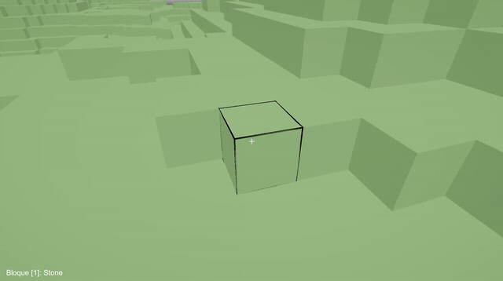
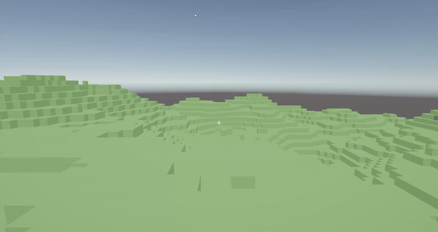

# Voxel Builder — AEVI Dev Contest 2026

Demo técnica de un entorno de construcción por bloques (estilo Minecraft) desarrollada en
**Unity 6 (6000.3) + URP** para el ejercicio de programación del *AEVI Dev Contest 2026*.
Todo el código es C# propio: sin assets externos ni paquetes adicionales.

**[⬇ Descargar ejecutable para Windows](../../releases/latest)**

| Colocar y eliminar bloques | Generación procedural del terreno |
|:---:|:---:|
|  |  |

## Características

- **Mundo procedural** generado con ruido Perlin por octavas y semilla reproducible.
- **Chunks de 16×16×16** con datos en un `byte[]` plano e indexado en un `Dictionary<Vector3Int, Chunk>`.
- **Mesh building con culled faces**: un único `Mesh` + `MeshCollider` por chunk, sin `GameObject` por bloque.
- **Reconstrucción diferida** de chunks *dirty* repartida entre frames, incluida la costura con chunks vecinos.
- **Chunk streaming** alrededor del jugador con radio ajustable en caliente.
- **Colocar / eliminar bloques** en tiempo real mediante raycast, con resaltado del bloque apuntado.
- **Guardar y cargar** el estado del mundo en disco.
- Controlador en primera persona con `CharacterController` y el nuevo Input System.

## Controles

| Acción | Tecla |
|---|---|
| Moverse / saltar | WASD / Espacio |
| Eliminar bloque | Clic izquierdo |
| Colocar bloque | Clic derecho |
| Seleccionar bloque | 1–7 / rueda del ratón |
| Regenerar mundo (nueva semilla) | R |
| Guardar / cargar mundo | F5 / F9 |
| Menú de pausa / liberar cursor | Escape |

## Estructura del código

```
Assets/Scripts/
  World/       Modelo de datos: BlockType, BlockDatabase, Chunk, World, ChunkMeshBuilder, WorldSerializer
  Generation/  TerrainGenerator, NoiseUtils
  Player/      PlayerController, BlockInteractor, BlockHighlightRenderer
  UI/          Hotbar, Crosshair, menú de pausa
  Core/        GameBootstrap, ChunkStreamer, WorldRenderer
```

## Cómo ejecutarlo

### Ejecutable (Windows)

1. Descarga `VoxelBuilder-Windows.zip` desde la [última release](../../releases/latest).
2. Descomprímelo y ejecuta `AEVI Dev Contest 26.exe`.

### Desde el código fuente

1. Clona el repositorio y ábrelo con **Unity 6000.3.6f1** (o compatible).
2. Abre `Assets/Scenes/SampleScene.unity` y pulsa *Play*.
